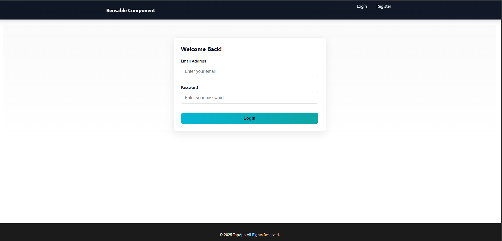
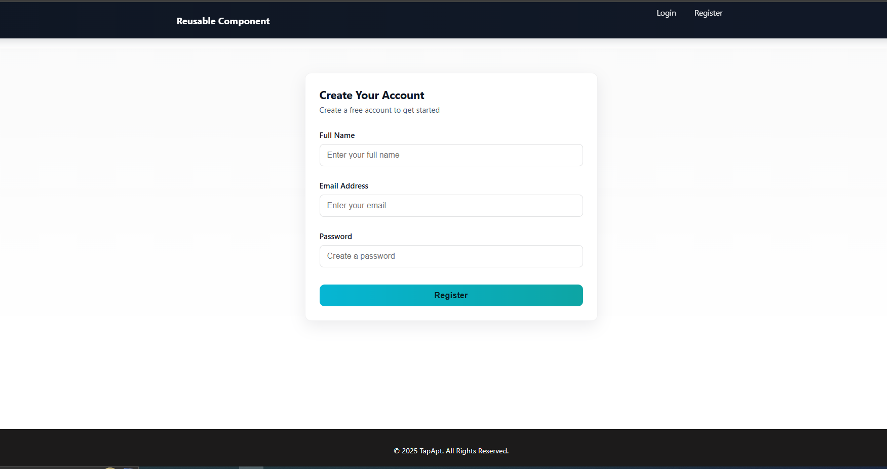

# Reusable Login & Signup MERN Component

A ready-to-use authentication module to kickstart **any MERN project**. This repo provides a modular login/signup system with image illustration, client/admin role-based authentication, and complete email OTP verification using SendGrid.

## Features

- **Fully functional login & signup pages** (with images)
- **Role-based authentication**: client & admin roles
- **Email OTP verification** using SendGrid
- Cleanly separated **client** and **server** code
- **Reusable**: plug this module into any MERN project

## Quick Start

### 1. Clone the Repository

```bash
git clone <your-repo-url>
cd login-signup-mern
```

### 2. Installation

Install dependencies for **both client and server:**

```bash
cd client
npm install
cd ../server
npm install
```

### 3. Configure Environment Variables

#### Server: `/server/.env`

```
CLIENT_URL="http://localhost:5173"
JWT_SECRET=your_jwt_secret
MONGO_URI="mongodb://localhost:27017/login-signup"
SENDGRID_API_KEY=your_sendgrid_api_key
SENDGRID_FROM_EMAIL="your-email@gmail.com"
PORT=8000
```

#### Client: `/client/.env`

```
VITE_API_BASE_URL="http://localhost:8000/api"
```

### 4. Run the App

Start the server:

```bash
cd server
npm start
```

Start the client (in another terminal):

```bash
cd client
npm run dev
```

## Usage

- Visit [**http://localhost:5173**](http://localhost:5173) to access the app.
- Sign up as a client or admin, verify email via OTP, and explore role-based flows.
- Ready to integrate into any new/existing MERN project.

## Tech Stack

- **Frontend:** React + Vite
- **Backend:** Node.js + Express
- **Database:** MongoDB
- **Email:** SendGrid (for OTP)

## Customization
- Change branding, colors, and logo in `client/src/components/Navbar.jsx` and CSS files.
- Update email logic in `server/utils/email.js`.
- Add fields or validation in `client/src/components/RegisterForm.jsx` and backend models.

## Screenshots
Login and Signup page examples:




## Folder Structure
```
client/   # React frontend
server/   # Express backend
```

## License
Open source, free to use and modify.

> **Tip:** This authentication system is modular and can be integrated into any MERN stack project as an initial auth layer!
